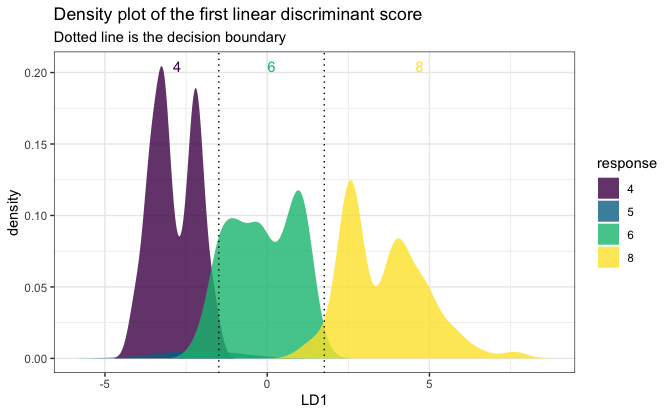

<!-- README.md is generated from README.Rmd. Please edit that file -->

# folda <a href="http://iamwangsiyu.com/folda/"></a>

<!-- badges: start -->

[](https://CRAN.R-project.org/package=folda)
[](https://github.com/Moran79/folda/actions/workflows/R-CMD-check.yaml)

<!-- badges: end -->

The `folda` package is an R modeling tool designed for fitting Forward
Stepwise Linear Discriminant Analysis (LDA) and Uncorrelated Linear
Discriminant Analysis (ULDA). If you’re unfamiliar with stepwise LDA or
ULDA, please refer to the following resources:

- For **stepwise LDA using Wilks’ Lambda**, see Section 6.11.1 in
  *Methods of Multivariate Analysis, Third Edition* by Alvin C. Rencher
  and William F. Christensen (2012).

- For **ULDA**, refer to Ye, J., & Yu, B. (2005). *Characterization of a
  family of algorithms for generalized discriminant analysis on
  undersampled problems.* Journal of Machine Learning Research, 6(4).
  [Link](https://www.jmlr.org/papers/volume6/ye05a/ye05a.pdf).

- For **a combination of ULDA and forward LDA using Pillai’s trace**,
  see Wang, S. (2024). *A New Forward Discriminant Analysis Framework
  Based on Pillai’s Trace and ULDA*. arXiv preprint arXiv:2409.03136.
  [Link](https://arxiv.org/abs/2409.03136).

## Installation

``` r
install.packages("folda")
```

You can install the development version of `folda` from
[GitHub](https://github.com/) with:

``` r
# install.packages("devtools")
devtools::install_github("Moran79/folda")
```

## Overview

If you’ve ever been frustrated by the warnings and errors from
`MASS::lda()`, you will appreciate the ULDA implementation in `folda()`.
It offers several key improvements:

- **No more “constant within group” errors!** ULDA can handle constant
  columns and perfect separation of groups.

- **Automatic missing value handling!** The implementation seamlessly
  integrates automatic missing value imputation during both training and
  testing phases.

- **Fast!** ULDA is implemented using the Generalized Singular Value
  Decomposition (GSVD) method, which diagonalizes both within-class and
  total scatter matrices simultaneously, offering a speed advantage over
  the sequential diagonalization used in `MASS::lda()` (see Howland et
  al., 2003 for more details). We have also rewritten the matrix
  decomposition modules (SVD, QR) using `RcppEigen`, further improving
  computational efficiency by leveraging optimized C++ code.

- **Better visualization!** `folda` uses `ggplot2` to provide
  visualizations of class separation in projected 2D spaces (or 1D
  histograms), offering valuable insights.

For the forward LDA implementation, `folda` offers the following
advantages over the classical framework:

- **No issues with multicollinearity or perfect linear dependency!**

- **Handles perfect separation and offers greater power!** The classical
  approach using Wilks’ Lambda has known limitations, including
  premature stopping when some (not all) groups are perfectly separated.
  Pillai’s trace, as used in `folda()`, not only effectively addresses
  perfect separation, but has also been shown to generally have greater
  statistical power than Wilks’ Lambda (Rencher et al., 2002).

## Basic Usage

``` r
library(folda)
mpg <- as.data.frame(ggplot2::mpg) # Prepare the data
datX <- mpg[, -5] # All predictors without Y
response <- mpg[, 5] # we try to predict "cyl" (number of cylinders)
```

Build a ULDA model with all variables:

``` r
fit <- folda(datX = datX, response = response, subsetMethod = "all")
```

Build a ULDA model with forward selection via Pillai’s trace:

``` r
fit <- folda(datX = datX, response = response, subsetMethod = "forward", testStat = "Pillai")
print(fit) # 6 out of 11 variables are selected, displ is the most important among them
#> 
#> Overall Pillai's trace: 1.325
#> Associated p-value: 4.636e-74
#> 
#> Prediction Results on Training Data:
#> Refitting Accuracy: 0.9188
#> Gini Index: 0.7004
#> 
#> Confusion Matrix:
#>          Actual
#> Predicted  4  5  6  8
#>         4 69  0  3  0
#>         5  8  4  2  0
#>         6  4  0 74  2
#>         8  0  0  0 68
#> 
#> Group means of LD scores:
#>           LD1         LD2        LD3
#> 4  3.05298379  0.02700248 -0.3555829
#> 5  1.87744449 -4.45014946  0.8156167
#> 6  0.06757888  0.28356907  0.5911862
#> 8 -3.71628852 -0.09697943 -0.3023424
#> 
#> Forward Selection Results:
#>                var statOverall   statDiff  threshold
#> 1            displ    0.873393 0.87339300 0.06545381
#> 2  modelnew beetle    1.029931 0.15653777 0.05673510
#> 3       modeljetta    1.141651 0.11172064 0.05496185
#> 4 modelcaravan 2wd    1.210165 0.06851331 0.05363507
#> 5     classmidsize    1.263449 0.05328468 0.05276500
#> 6              cty    1.325255 0.06180560 0.05194279
```

Plot the results:

``` r
plot(fit, datX = datX, response = response)
```


One-dimensional plot:

``` r
# A 1D plot is created when there is only one feature 
# or for binary classification problems.
mpgSmall <- mpg[, c("cyl", "displ")]
fitSmall <- folda(mpgSmall[, -1, drop = FALSE], mpgSmall[, 1])
plot(fitSmall, mpgSmall, mpgSmall[, 1])
```



Make predictions:

``` r
head(predict(fit, datX, type = "response"))
#> [1] "4" "4" "4" "4" "6" "4"
head(predict(fit, datX, type = "prob")) # Posterior probabilities
#>           4            5            6            8
#> 1 0.9966769 7.475058e-08 0.0033230408 7.023764e-12
#> 2 0.9994438 1.401133e-08 0.0005562131 5.338710e-13
#> 3 0.9970911 3.835722e-08 0.0029088506 1.738154e-11
#> 4 0.9983963 2.196016e-08 0.0016037009 7.365641e-12
#> 5 0.3122116 6.809673e-07 0.6877815595 6.173116e-06
#> 6 0.5995781 4.275271e-07 0.4004193019 2.123291e-06
```

More examples can be found in the
[vignette](https://iamwangsiyu.com/folda/articles/folda.html).

## References

- Howland, P., Jeon, M., & Park, H. (2003). Structure preserving
  dimension reduction for clustered text data based on the generalized
  singular value decomposition. *SIAM Journal on Matrix Analysis and
  Applications*, 25(1), 165-179.

- Rencher, A. C., & Christensen, W. F. (2002). *Methods of Multivariate
  Analysis* (Vol. 727). John Wiley & Sons.

- Wang, S. (2024). A new forward discriminant analysis framework based
  on Pillai’s trace and ULDA. *arXiv preprint*, arXiv:2409.03136.
  Retrieved from <https://arxiv.org/abs/2409.03136>.

## Getting help

If you encounter a clear bug, please file an issue with a minimal
reproducible example on
[GitHub](https://github.com/Moran79/folda/issues)
